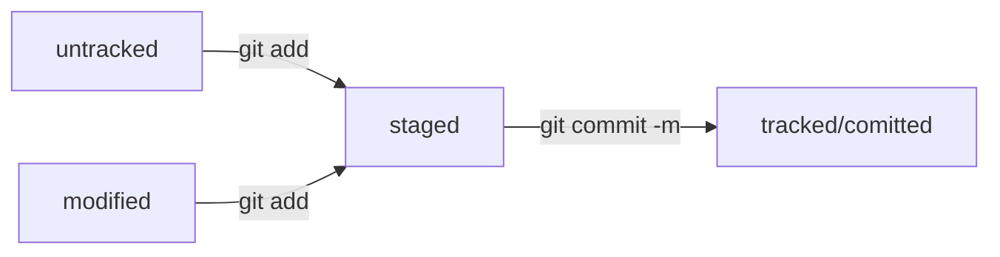

# Шпаргалка. Базовые команды в консоли  

## Навигация  

* pwd -(от англ. print working directory, «показать рабочую папку») — покажи, в какой я папке;

* ls - (от англ. list directory contents, «отобразить содержимое директории») — покажи файлы и папки в текущей папке;

* ls -a - покажи также скрытые файлы и папки, названия которых начинаются с символа .;

* cd first-project (от англ. change directory, «сменить директорию») - перейди в папку first-project;

* cd first-project/html - перейди в папку html, которая находится в папке first-project;

* cd.. - перейди на уровень выше, в родительскую папку;

* cd~ - перейди в домашнюю директорию (/Users/Username);

* cd/ - перейди в корневую директорию.

## Работа с файлами и папками

### Создание

* touch index.html (англ. touch, «коснуться») - создай файл index.html в текущей папке;

* touch index.html style.css script.js — если нужно создать сразу несколько файлов, можно напечатать их имена в одну строку через пробел;

* mkdir second-project (от англ. make directory, «создать директорию») - создай папку с именем second-project в текущей папке.

### Копирование и перемещение

* cp file.txt ~/my-dir (от англ. copy, «копировать») - скопируй файл в другое место;

* mv file.txt ~/my-dir (от англ. move, «переместить») - перемести файл или папку в другое место.

### Чтение

* cat file.txt (от англ. concatenate and print, «объединить и распечатать») — распечатай содержимое текстового файла file.txt.

### Удаление

* rm about.html (от англ. remove, «удалить») - удали файл about.html;

* rmdir images (от англ. remove directory, «удалить директорию») - удали папку images;

* rm -r second-project (от англ. remove, «удалить» + recursive, «рекурсивный») - удали папку second-project и всё, что она содержит.

## Полезные возможности

* Команды необязательно печатать и выполнять по очереди. Можно указать их списком — разделить двумя амперсандами (&&). 

* У консоли есть собственная память - буфер с несколькими последними командами. По ним можно перемещаться с помощью клавиш со стрелками вверх (↑) и вниз (↓).

* Чтобы не вводить название файла или папки полностью, можно набрать первые символы имени и дважды нажать Tab. Если файл или папка есть в текущей директории, командная строка допишет путь сама.  
Например, вы находитесь в папке dev. Начните вводить cd first и дважды нажмите Tab. Если папка first-project есть внутри dev, командная строка автоматически подставит её имя. Останется только нажать Enter.

## Комиты

* $ git commit -m "Текст коментария" - добавить коммит

* $ git log - посмотреть историю коммитов

* $ git log --oneline - посмотреть сокращенный лог

## Работа с ключами и удаленным репозиторием

* ls -la .ssh/ - вывести список созданных ключей

* $ clip < ~/.ssh/id_rsa.pub - скопировать содержимое ключа в буфер обмена (для rsa)

* $ clip < ~/.ssh/id_ed25519.pub - скопировать содержимое ключа в буфер обмена (для ed25519)

* $ git remote add origin git@github.com:%ИМЯ_АККАУНТА%/%ИМЯ_РЕПОЗИТОРИЯ%.git - привязать удаленный репозиторий к локальному

* $ git remote -v - убедиться, что репозитории связаны

* $ git push -u origin main - ПЕРВАЯ отправка изменений на удаленный репозиторий

* $ git push - ВТОРАЯ и последующие отправки изменений на удаленный репозиторий

## Статусы файлов

* $ git satus - проверить статус файлов.  
Файл может быть в состоянии untracked, staged, modified, tracked.  
git satus явно показывает следующие состояния файлов: untracked, staged, modified. 

## Хеш — основной идентификатор коммита

* Git преобразует информацию о коммитах с помощью алгоритма SHA-1 и для каждого из них рассчитывает уникальный идентификатор — хеш.

* Хеш — основной идентификатор коммита и позволяет узнать его автора, дату и содержимое закоммиченных файлов.

* Все хеши, а также таблицу соответствий хеш → информация о коммите Git хранит в папке .git.

## Исправить коммит

Важно: опция --amend работает только с последним коммитом (HEAD). Для исправления более ранних коммитов команда НЕ подходит.

* git commit --amend --no-edit - добавить в коммит новый файл. С опцией --amend команда commit не создаст новый коммит, а дополнит последний, просто добавив в него новый файл. При этом хеш последнего коммита изменится, потому что изменился список файлов в коммите.

* git commit --amend -m "Новое сообщение" - изменить сообщение коммита.

## Откаты к предыдущему состоянию

* git restore --staged <file> - переведёт файл из staged обратно в modified или untracked. Если файл не попадёт в коммит, никто не увидит его на GitHub.

* git reset --hard <commit hash> - «откатит» историю до коммита с хешем <hash>. Более поздние коммиты потеряются!

* git restore <file> «откатит» изменения в файле до последней сохранённой (в коммите или в staging) версии. По сути, это удалит все текущие изменения в файле.

